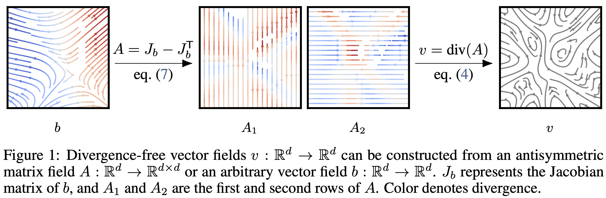

# Neural Conservation Laws: A Divergence-Free Perspective

This repo contains code for the NeurIPS 2022 paper https://arxiv.org/abs/2210.01741.

<p align="center">

</p>

## Experiments

Experiments on training Neural Conservation Laws (and baselines) for fluid simulation are available in the `jax` subdirectory.

Experiments on training Neural Conservation Laws (and baselines) for dynamical optimal transport are available in the `pytorch` subdirectory.

## Citations
If you find this repository helpful for your publications,
please consider citing our paper:

```
@inproceedings{
    richter-powell2022neural,
    title={Neural Conservation Laws: A Divergence-Free Perspective},
    author={Jack Richter-Powell and Yaron Lipman and Ricky T. Q. Chen},
    booktitle={Advances in Neural Information Processing Systems},
    year={2022},
}
```

## License
This repository is licensed under the
[CC BY-NC 4.0 License](https://creativecommons.org/licenses/by-nc/4.0/).